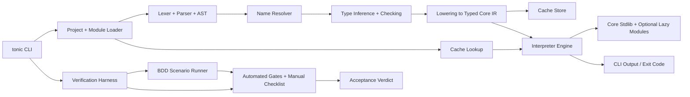
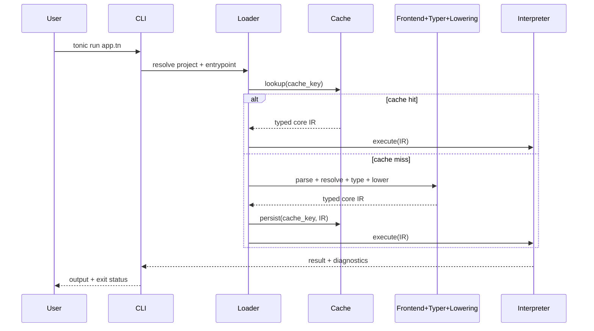
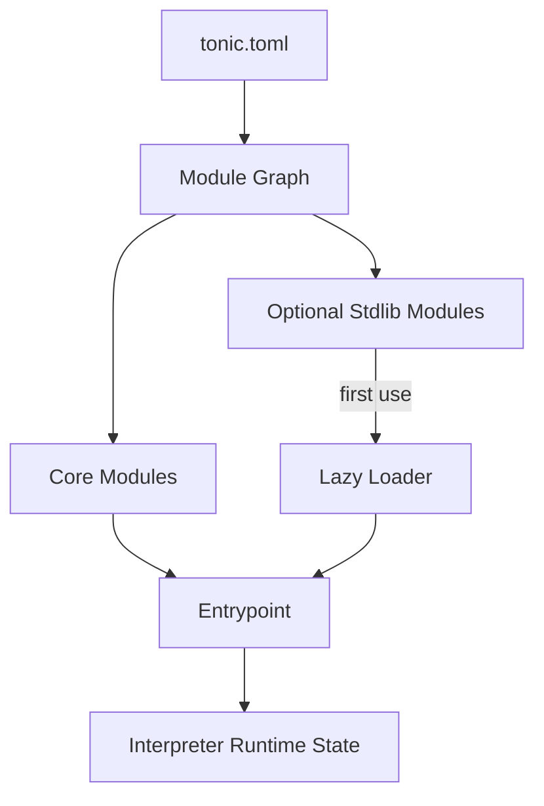
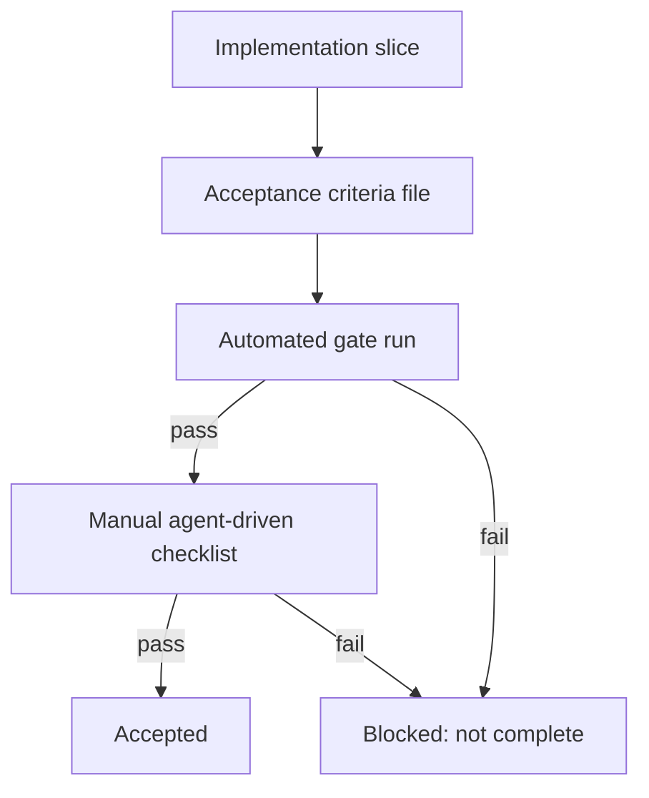

# Detailed Design: Elixir-Inspired Language Core for Fast CLI Applications (v0)

## Overview

This document defines the v0 design for a new language with **Elixir-inspired syntax** and a **Rust-based standalone runtime** optimized for CLI startup speed and low memory use.

The design intentionally focuses on the **language core first** (syntax, typing, execution, module/package workflow) and defers TUI-specific runtime features to a later phase.

v0 goals:
- Preserve familiar Elixir-like coding ergonomics.
- Ship a practical CLI-capable runtime quickly.
- Enforce strict startup/memory performance targets.
- Use battle-tested, portable build/release tooling.

v0 non-goals:
- BEAM/OTP runtime compatibility.
- Full `mix` compatibility.
- Runtime macro system and dynamic eval.
- Actor/process supervision model.

---

## Detailed Requirements

This section consolidates requirements clarified in `idea-honing.md`.

### Product and Scope Requirements

1. **Language-first roadmap**
   - v0 prioritizes language core; TUI concerns are deferred.

2. **Syntax direction**
   - Syntax is **Elixir-inspired but simplified** (fewer special cases).

3. **Runtime compatibility boundary**
   - Syntax compatibility only; **no BEAM runtime compatibility** target.

4. **Toolchain**
   - Implementation in **Rust**.

5. **Project/package workflow**
   - No full `mix` runtime behavior.
   - Use language-native manifest and commands in v0.

### Language Feature Requirements (v0)

6. **Core forms included**
   - `defmodule`, `def`, `if`, `case`, `cond`, `fn`
   - Pattern matching in function heads and `case`
   - Pipe operator `|>`
   - Core collection operations (`Enum`-style equivalents)
   - Maps, tuples, keyword-list representation
   - Protocols

7. **Features explicitly deferred**
   - Macros (`defmacro`)
   - Dynamic runtime eval (`Code.eval_*` style)
   - OTP-like process/actor runtime

8. **Typing model**
   - Static typing with inference.
   - Mostly strict, with a small explicit `dynamic` escape hatch.

9. **Error model**
   - Result-first: `ok(value)` / `err(reason)` + propagation operator `?`.
   - Panic reserved for unrecoverable faults.

### Runtime and Performance Requirements

10. **Execution strategy**
   - Tree-walking interpreter + on-disk compiled cache.

11. **Performance gates (non-negotiable in v0)**
   - Cold start (simple script): **<= 50 ms**
   - Warm start (cache hit): **<= 10 ms**
   - Idle RSS after startup: **<= 30 MB**

12. **Backpressure + acceptance verification gates (non-negotiable in v0)**
   - Every implementation slice must define explicit acceptance criteria (pass/fail, demoable outcomes).
   - Acceptance criteria are authored as BDD scenarios and executed in dual-run mode (automated and agent-manual).
   - Completion is blocked unless:
     1) automated gates pass (correctness + performance), and
     2) manual agent-driven verification checklist passes.
   - No task is considered done on “looks good”; only objective gate results and checklist evidence.

---

## Architecture Overview

The runtime is split into a compiler-lite frontend and a compact execution backend. The backend interprets a lowered, typed IR and uses a persistent cache for fast repeat runs.

### Runtime execution lifecycle

### Component relationship model

### Acceptance verification lifecycle

---

## Components and Interfaces

## 1) CLI and project commands

**Binary:** `tonic`

v0 commands:
- `tonic run <file|module>`
- `tonic check <path>` (parse+typecheck only)
- `tonic test`
- `tonic fmt`
- `tonic cache clear`

Primary CLI interface contract:
- deterministic exit codes
- machine-readable diagnostics mode (`--json`)
- startup benchmark mode (`tonic bench startup`)

## 2) Parser frontend

Responsibilities:
- tokenization and parsing of Elixir-inspired syntax subset
- AST construction with stable node IDs
- source span tracking for diagnostics

Interface sketch:
- `parse(source: &str) -> Result<AstModule, ParseError>`

## 3) Resolver + type inference/checker

Responsibilities:
- namespace and symbol resolution
- protocol conformance resolution
- static type inference/checking
- explicit `dynamic` boundary validation

Typing policy:
- inference-first local/global type solving
- mostly strict typing
- explicit dynamic escape only via language syntax (e.g. type annotation or cast boundary)

Interface sketch:
- `typecheck(ast: AstModule, env: TypeEnv) -> Result<TypedModule, TypeErrorSet>`

## 4) Lowering and executable IR

Responsibilities:
- convert typed AST to compact, interpreter-friendly typed core IR
- preserve enough source mapping for runtime error reporting

Interface sketch:
- `lower(typed: TypedModule) -> CoreIrModule`

## 5) Interpreter engine (v0)

Responsibilities:
- execute core IR in a deterministic runtime
- evaluate pattern matches, guards, pipelines
- enforce Result-first control flow semantics

Runtime behavior:
- panic only for runtime invariants/irrecoverable faults
- user recoverable errors returned as `err(reason)`

## 6) Cache subsystem

Responsibilities:
- persistent cache for lowered typed IR
- fast hit/miss checks using key metadata
- corruption-safe fallback (ignore bad entry, recompile)

Interface sketch:
- `cache_key(entry, deps, runtime_version, target, flags) -> CacheKey`
- `load(CacheKey) -> Option<CoreIrModule>`
- `store(CacheKey, CoreIrModule) -> Result<()>`

## 7) Module and package subsystem

Responsibilities:
- parse and validate project manifest (`tonic.toml`)
- resolve project-local modules and dependencies
- lazy-load optional stdlib modules

v0 compatibility rule:
- no full `mix` behavior; project model is language-native

## 8) Verification harness + acceptance gates

Responsibilities:
- execute automated acceptance gates for each implementation slice
- run manual agent-driven verification checklist and capture evidence
- enforce “blocked until green” policy for done status

Acceptance artifact contract:
- each slice defines an acceptance file with:
  - objective pass/fail criteria
  - required commands to run
  - demo checklist items (manual verification)
  - evidence capture fields (output snippets, timings, screenshots/terminal captures if relevant)

Interface sketch:
- `verify run <slice-id>` -> executes automated checks + manual checklist workflow
- `verify report <slice-id> --json` -> machine-readable acceptance verdict + evidence references

Completion rule:
- `done` requires both automated and manual verification marked pass.

## 9) BDD scenario runner (dual execution)

Responsibilities:
- parse and execute Gherkin `.feature` scenarios linked to each implementation slice
- support scenario tags for execution strategy (`@auto`, `@agent-manual`, `@human-manual`)
- run the same scenario set in different modes (`auto`, `mixed`, `manual`) without duplicating acceptance logic

Execution modes:
- `auto`: run only machine-executable steps (`@auto`)
- `mixed`: run `@auto` + `@agent-manual`, collect evidence for manual-tagged steps
- `manual`: run full checklist-oriented flow for agent/human verification

Interface sketch:
- `verify run <slice-id> --mode auto|mixed|manual`
- `verify bdd <feature-file> --mode auto|mixed|manual`
- `verify report <slice-id> --json` (includes scenario-level results and evidence pointers)

---

## Data Models

## Source-level data model

- `ModuleDecl { name, imports, defs }`
- `FnDecl { name, params, return_type?, body, visibility }`
- `Expr` variants: literal, var, call, pipe, case, cond, fn, match, map, tuple, list
- `Pattern` variants: literal, tuple, list, map, constructor, wildcard, bind

## Type model

- Primitive: `Int`, `Float`, `Bool`, `String`, `Atom`, `Unit`
- Composite: `List<T>`, `Tuple<T...>`, `Map<K,V>`, `KeywordList<V>`
- Algebraic / tagged unions for Result and user sum types
- Function: `(T1, T2, ...) -> Tn`
- Escape hatch: `Dynamic`

Result type:
- `Result<T, E> = Ok(T) | Err(E)`

## Core IR model

- module index table
- function table with typed signatures
- instruction/term tree for interpreter evaluation
- source map table for diagnostics

## Runtime state

- call stack frames (function, locals, spans)
- module table (loaded/lazy states)
- intern table (symbols/atoms/strings)
- immutable heap values + controlled mutable cells

## Cache model

- `CacheKey` fields:
  - entry module path hash
  - transitive dependency content hash
  - runtime version
  - target triple
  - feature flags
- `CacheEntry` fields:
  - serialized core IR
  - source map checksum
  - metadata + timestamp

## Project manifest model (`tonic.toml`)

- package metadata (`name`, `version`, `edition`)
- dependencies
- build/runtime flags
- entrypoint and test config

## Acceptance criteria model (`acceptance/<slice-id>.yaml`)

- `slice_id`: stable implementation slice identifier
- `objectives`: short statement of expected capability
- `feature_files`: list of linked BDD files under `acceptance/features/`
- `mode_default`: `auto | mixed | manual`
- `automated_checks`: required commands and expected outcomes
- `performance_gates`: thresholds relevant to the slice
- `manual_checklist`: observable behaviors an agent/human must verify
- `evidence`: required artifacts/links/log excerpts
- `status`: `pending | auto_pass | manual_pass | accepted | blocked`

## BDD feature model (`acceptance/features/<slice-id>.feature`)

- Gherkin scenarios with reusable step vocabulary
- scenario tags define execution path:
  - `@auto` for code-executed steps
  - `@agent-manual` for agent-run manual validations with structured evidence
  - `@human-manual` for optional human-only checks when needed

## Step evidence model (`acceptance/evidence/<slice-id>.json`)

- scenario id + step id
- execution mode and actor (`auto`, `agent`, `human`)
- pass/fail verdict per step
- captured artifacts (stdout snippets, timings, files)
- rationale/notes for manual decisions

---

## Error Handling

v0 error classes:

1. **Parse errors**
   - invalid syntax
   - malformed constructs

2. **Resolution errors**
   - undefined symbols
   - ambiguous imports
   - protocol impl conflicts

3. **Type errors**
   - mismatch
   - non-exhaustive match
   - invalid use of `dynamic`

4. **Runtime recoverable errors**
   - returned as `Err(reason)` and propagated with `?`

5. **Runtime panics (unrecoverable)**
   - internal invariants violated
   - corrupted runtime state

6. **Cache errors**
   - corruption/incompatibility triggers automatic cache miss fallback

Diagnostic requirements:
- stable error codes
- source span annotations
- one-line concise message + expanded context mode
- JSON output mode for tooling

---

## Testing Strategy

## Correctness testing

- Parser golden tests for syntax forms.
- Type inference and checking unit tests.
- Pattern matching exhaustiveness tests.
- Protocol conformance tests.
- Result propagation behavior tests.
- Cache integrity and invalidation tests.

## Integration testing

- End-to-end command tests (`run`, `check`, `test`, `fmt`).
- Multi-module project resolution tests.
- Cross-platform command behavior tests (Linux/macOS/Windows).

## Performance testing (blocking gates)

- Cold-start benchmark for tiny script (p50 <= 50 ms).
- Warm-start benchmark with cache hit (p50 <= 10 ms).
- Idle RSS benchmark (<= 30 MB).
- Regression threshold policy in CI (fail on meaningful deltas).

## Reliability testing

- Fuzz parser and selected IR execution paths.
- Property tests for resolver/type rules where feasible.
- Cache corruption simulation and recovery tests.

## Backpressure and acceptance verification (blocking)

### BDD as the acceptance source of truth

Each slice must include Gherkin scenarios in `acceptance/features/<slice-id>.feature`.

Scenario tags determine execution path:
- `@auto`: executable by code harness only
- `@agent-manual`: executed by agent with required structured evidence
- `@human-manual`: optional human-run checks for edge UX/ergonomics

### Dual-run execution modes

- `auto`: runs `@auto` scenarios only (CI default)
- `mixed`: runs `@auto` + `@agent-manual` (default for completion checks)
- `manual`: runs all relevant manual workflows (`@agent-manual`, `@human-manual`)

### Automated backpressure gates

For each implementation slice, automated checks must pass before manual verification:

- required unit/integration tests
- lint/format checks
- applicable performance gate checks
- BDD `@auto` scenario pass status
- any slice-specific command assertions from acceptance file

If any gate fails, the slice is blocked and cannot be marked complete.

### Manual agent-driven verification

After automated gates pass, run tagged BDD manual scenarios and checklist steps:

- run the feature as a user would
- validate expected visible behavior and failure modes
- confirm diagnostics and error messages are actionable
- capture evidence (command output, timings, logs)
- record step-level evidence JSON for each manual scenario

Manual verification is not optional for acceptance. It provides backpressure against false positives from narrow automated checks.

### Acceptance completion policy

A slice is accepted only when all are true:

1. automated backpressure gates = pass
2. BDD manual scenarios required by mode = pass
3. manual agent-driven checklist = pass
4. evidence artifacts captured and linked in verification report

No green checklist item means no completion declaration.

---

## Appendices

## A) Technology Choices (with pros/cons)

### Rust + Cargo + LLVM (selected)

Pros:
- mature ecosystem and tooling
- high performance and memory safety
- strong cross-platform CI options (`cross`, `cargo-zigbuild`)

Cons:
- compiler complexity (borrow/lifetime ergonomics)
- build times need active management

### Zig as primary toolchain (deferred consideration)

Pros:
- strong cross-compilation ergonomics
- excellent native binary characteristics

Cons:
- faster-evolving surface and migration churn risk for v0

### JVM/GraalVM path (not selected for v0)

Pros:
- rich ecosystem

Cons:
- larger startup and packaging complexity for this product target
- native-image constraints for dynamic/runtime-heavy features

## B) Research Findings Summary

- Fast CLI runtimes require strict startup-path minimization.
- Lazy loading and caching provide largest startup/memory wins.
- Result-first error model aligns with static typing and runtime simplicity.
- Interpreter + compiled cache is the best v0 speed-to-market/performance tradeoff.
- Terminal portability is important, but intentionally out of v0 language-core scope.

## C) Alternative Approaches Considered

1. **Near-identical Elixir syntax + broad compatibility**
   - Rejected for v0 due to complexity and slower iteration.

2. **Bytecode VM from day one**
   - Rejected for v0 due to schedule risk; kept as v1 evolution path.

3. **Dynamic typing for v0**
   - Rejected by requirement decision; static inference chosen.

4. **Full `mix` compatibility**
   - Rejected due to scope and runtime coupling.

---

## Connections
- [[../rough-idea.md]]
- [[../idea-honing.md]]
- [[../research/research-plan.md]]
- [[../research/06-runtime-semantics-gap.md]]
- [[../research/07-startup-memory-techniques.md]]
- [[../research/08-toolchain-portability-gap.md]]
- [[../research/09-terminal-portability-gap.md]]
- [[../research/10-practitioner-signals.md]]
- [[../research/gap-closure-summary.md]]
