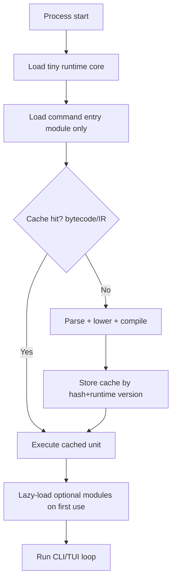

# Runtime Semantics Gap Closure (Startup + Memory)

## Goal
Define runtime semantics that keep an Elixir-like CLI/TUI language fast at cold start and small in memory, without painting us into a tooling/portability corner.

## Decision Summary (recommended for v0)

| Semantic lever | Recommendation | Startup impact | Memory impact | Portability/toolchain impact |
|---|---|---:|---:|---|
| Module loading | Lazy-load non-core modules; preload tiny core only | High positive | High positive | Neutral/positive |
| Error model | `ok(value)` / `err(reason)` + `?` propagation (no exception-heavy happy path) | Medium positive | Medium positive | Positive (simpler runtime) |
| Pattern matching | Compile to decision trees + exhaustiveness checks | Medium positive | Low positive | Positive (compile-time validation) |
| Macros/eval | Compile-time macros only in v0; no runtime `eval` by default | Medium positive | Medium positive | Positive (smaller runtime binary) |
| Mutability | Immutable-by-default with explicit mutable cells (`atom`/`mut`) | Neutral startup | Medium positive (predictable sharing) | Neutral |
| Concurrency | Structured async tasks + channels; defer BEAM-like process runtime | Medium positive | Medium positive | Positive (portable async runtimes exist) |
| FFI/process model | Process-first FFI (shell/subprocess) + narrow native plugin boundary | High positive | Medium positive | Positive (cross-platform surface is smaller) |

## Why these calls

1. **Lazy module loading is non-negotiable for startup**
   - Python’s PEP 690 reports up to **70% startup improvements** and **40% memory reduction** in real-world CLIs when imports are lazy.
   - For this project: keep `core` eager, everything else lazy.

2. **Result-based errors beat exception-heavy paths for CLIs**
   - Gleam’s explicit `Result` model avoids exception machinery on normal control paths.
   - Recommendation: make `ok/err` first-class and reserve panics for truly unrecoverable errors.

3. **Pattern matching should stay, but compiled aggressively**
   - Compile match constructs to decision trees (Maranget-style) and run exhaustiveness checks at compile time.
   - Keeps ergonomics while reducing runtime branching overhead and runtime match failures.

4. **No runtime macro compiler in v0 runtime**
   - Clojure-style macro expansion is a compile-time transform model.
   - Keep runtime minimal: execute already-expanded/compiled artifacts where possible.

5. **Concurrency should match CLI/TUI needs, not BEAM semantics**
   - BEAM process model is excellent for distributed systems but expensive for a tiny scripting runtime target.
   - Use structured async as default. Tokio’s task model is lightweight and portable.

## Runtime startup path (recommended)

## v0 Semantics Profile (concrete)

- **Keep:** modules/namespaces, pipeline operator, pattern matching, tagged tuples/variants, protocols.
- **Defer:** runtime metaprogramming, global mutable state, distributed actor runtime, full OTP compatibility.
- **Execution model:**
  - command mode (one-shot),
  - optional long-lived TUI loop,
  - async subprocess and stream APIs as primitives.

## Metrics to enforce (CI gate)

- Cold start p50: **<= 50 ms** (stretch: <= 20 ms)
- Idle RSS p50: **<= 30 MB**
- Repeated command warm-start p50: **<= 10 ms** with cache hit
- TUI frame p95 (idle + input): **<= 16 ms**

## Open questions to settle next

1. Should `?` auto-convert foreign errors into a unified runtime error type, or require explicit mapping?
2. Should pattern matching allow guard expressions in v0, or defer to v1 for simpler compilation?
3. Should concurrency primitives include cancellation tokens in v0, or only channels + task handles?

## References

- https://peps.python.org/pep-0690/
- https://tour.gleam.run/data-types/results/
- https://clojure.org/reference/macros
- http://moscova.inria.fr/~maranget/papers/ml05e-maranget.pdf
- http://moscova.inria.fr/~maranget/papers/warn/warn.pdf
- https://tokio.rs/tokio/tutorial/spawning
- https://www.erlang.org/docs/23/efficiency_guide/processes.html
- https://github.com/babashka/babashka
- https://github.com/babashka/sci
- https://nodejs.org/api/modules.html

## Connections
- [[../idea-honing.md]]
- [[07-startup-memory-techniques.md]]
- [[08-toolchain-portability-gap.md]]
- [[09-terminal-portability-gap.md]]
- [[small-improvement-rho-dashboard]]
- [[openclaw-runtime-visibility-inspiration]]
