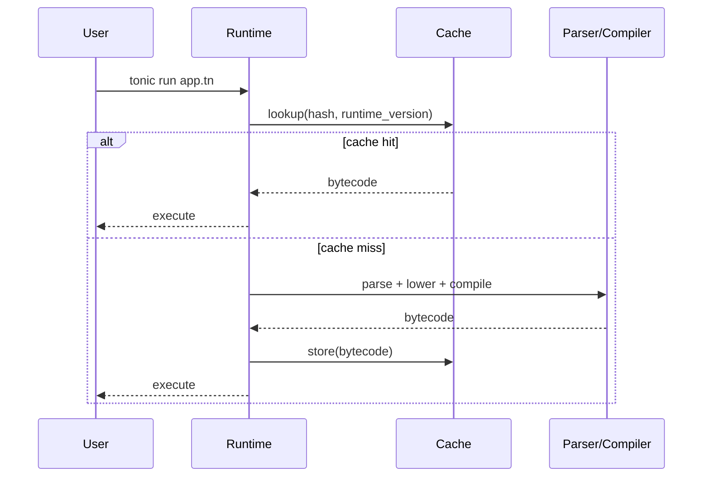

# Startup + Memory Techniques (Portable Runtime)

## Goal
Close the research gap on practical techniques that materially improve cold-start and RSS for a CLI/TUI-first language runtime.

## High-impact techniques (ranked)

1. **Lazy module loading and stdlib partitioning**
   - Preload only `core` and command parser.
   - Load heavy modules (`http`, `json`, `tui`, `fs-watch`, etc.) on first use.
   - Evidence: PEP 690 reports major startup and memory improvements in CLI workloads.

2. **Persistent on-disk cache for parsed/compiled units**
   - Cache key: file hash + runtime version + target triple + feature flags.
   - Store compact bytecode/IR in user cache dir.
   - Use optimistic fast-path: check metadata first; avoid content read when mtime+size unchanged.

3. **Interning + arena allocation on hot startup path**
   - Intern identifiers/symbols/keywords once.
   - Arena allocate parse trees and discard whole arena post-lowering.
   - Reduces allocator churn and fragmentation.

4. **Trim cold-start path aggressively**
   - No eager plugin scanning.
   - No eager dynamic linker work unless required.
   - Defer diagnostics prettification tables/theme loading until first error render.

5. **Static single-binary distribution with tuned release profile**
   - Build with size/speed profile tuned for CLI startup.
   - Keep dependency graph thin to reduce relocation/page-fault overhead.

6. **Process-first FFI**
   - Prefer subprocesses for ecosystem integration in v0.
   - Narrow native extension ABI later (v1), not at bootstrap.

## Implementation checklist for v0

- [ ] Add two-phase startup: `bootstrap_core()` then `load_entrypoint()`
- [ ] Split stdlib into `core` (eager) + `optional/*` (lazy)
- [ ] Add bytecode cache in XDG cache dir
- [ ] Add string/symbol interner
- [ ] Add parser/lowering arenas
- [ ] Add `--no-cache` and `cache clear` for debugging
- [ ] Add cold-start benchmark job in CI
- [ ] Add RSS benchmark in CI (`/usr/bin/time -v`)

## Benchmark methodology (must-run)

### Commands

```bash
hyperfine --warmup 5 './tonic run examples/hello.tn'
/usr/bin/time -v ./tonic run examples/hello.tn
strace -f -c ./tonic run examples/hello.tn
```

### Test scenarios

1. **Tiny script** (`hello`) cold and warm.
2. **Module-heavy CLI command** with many imports.
3. **TUI startup** to first frame.
4. **Subprocess-heavy command** (spawn + stream).

### Reported metrics

- Startup p50/p95 (cold and warm)
- Max RSS and average RSS
- Page faults (major/minor)
- Syscall profile (open/stat/read/mmap)
- Cache hit ratio

## Data flow for fast-start execution



## Practical baseline targets

- Cold start: <= 50 ms at p50 (stretch <= 20 ms)
- Warm start (cache hit): <= 10 ms at p50
- Idle RSS after command init: <= 30 MB
- TUI first-frame time: <= 100 ms

## Risks and mitigations

- **Risk:** stale cache bugs
  - **Mitigation:** strict versioned cache key + integrity checksum
- **Risk:** allocator choice regressions on some targets
  - **Mitigation:** benchmark default allocator vs alternatives per target before switching globally
- **Risk:** over-optimization before semantics stabilize
  - **Mitigation:** gate micro-optimizations behind benchmark evidence

## References

- https://peps.python.org/pep-0690/
- https://v8.dev/blog/code-caching
- https://v8.dev/blog/improved-code-caching
- https://nodejs.org/api/modules.html
- https://github.com/babashka/babashka
- https://github.com/babashka/sci
- https://doc.rust-lang.org/cargo/reference/profiles.html
- https://doc.rust-lang.org/rustc/codegen-options/index.html
- https://nnethercote.github.io/perf-book/build-configuration.html
- https://github.com/johnthagen/min-sized-rust

## Connections
- [[../idea-honing.md]]
- [[06-runtime-semantics-gap.md]]
- [[08-toolchain-portability-gap.md]]
- [[09-terminal-portability-gap.md]]
- [[small-improvement-rho-dashboard]]
- [[openclaw-runtime-visibility-inspiration]]
