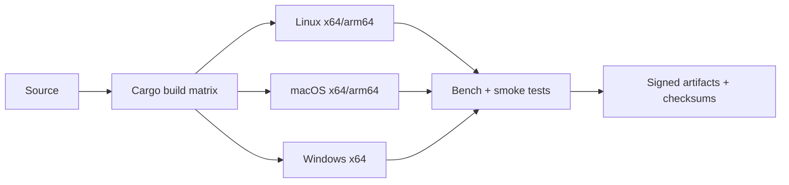

# Toolchain + Portability Gap Closure

## Goal
Select a battle-tested compilation toolchain strategy that preserves portability while keeping startup and memory low.

## Toolchain comparison

| Path | Startup profile | Binary size profile | Cross-platform story | Maturity | Main risks |
|---|---|---|---|---|---|
| Rust (`rustc` + LLVM + Cargo) | Excellent for native CLI | Good (often small with profile tuning) | Strong (`cross`, `cargo-zigbuild`, target triples) | Very high | Borrow-check friction in runtime internals |
| Zig toolchain | Excellent | Excellent | Very strong cross-compilation ergonomics | Medium-high, still evolving quickly | Breaking changes between releases |
| C/C++ (Clang/GCC) | Excellent | Excellent | Strong but more manual toolchain management | Very high | Memory safety and maintenance complexity |
| GraalVM native-image | Better than JVM warmup | Often larger binaries | Limited cross-compile ergonomics, metadata burden | High | Reflection/dynamic feature constraints |
| JVM-hosted runtime | Weak cold-start for CLI | N/A (JAR model) | Portable runtime, poor CLI startup | Very high | Startup/RSS mismatch with project goals |

## Recommendation

### v0 (recommended)
**Rust + Cargo + LLVM, with `cross` for CI matrix builds.**

Why:
- Battle-tested, mature dependency/tooling ecosystem.
- Strong profiling and benchmarking ecosystem.
- Good portability for Linux/macOS/Windows.
- Static/small binaries are practical with release profile tuning.

### v1 augmentation
- Evaluate **`cargo-zigbuild`** where libc/SDK friction appears in CI.
- Re-evaluate Zig as primary only after language/runtime semantics stabilize.

## Minimal build profile guidance

```toml
[profile.release]
opt-level = "z"
codegen-units = 1
lto = "fat"
panic = "abort"
strip = "symbols"
```

> Note: this is a starting point; measure against `opt-level=3` for runtime-sensitive loops.

## Reproducibility and release hardening

- Use `SOURCE_DATE_EPOCH` in release pipeline.
- Pin toolchain versions (`rust-toolchain.toml`, lockfiles).
- Produce checksums and SBOM for release artifacts.

## Build/release architecture



## Portability caveats to manage early

1. Windows terminal stack (ConPTY behavior) needs dedicated test coverage.
2. macOS signing/notarization flow should be validated before public release.
3. Cross-compiling with native deps must be constrained (or avoided in v0).

## References

- https://github.com/cross-rs/cross
- https://github.com/rust-cross/cargo-zigbuild
- https://doc.rust-lang.org/cargo/reference/profiles.html
- https://doc.rust-lang.org/rustc/codegen-options/index.html
- https://clang.llvm.org/docs/CrossCompilation.html
- https://ziglang.org/download/0.14.0/release-notes.html
- https://www.graalvm.org/latest/reference-manual/native-image/metadata/Compatibility/
- https://github.com/oracle/graal/issues/2931
- https://reproducible-builds.org/specs/source-date-epoch/
- https://reproducible-builds.org/docs/source-date-epoch/

## Connections
- [[../idea-honing.md]]
- [[06-runtime-semantics-gap.md]]
- [[07-startup-memory-techniques.md]]
- [[09-terminal-portability-gap.md]]
- [[small-improvement-rho-dashboard]]
- [[openclaw-runtime-visibility-inspiration]]
