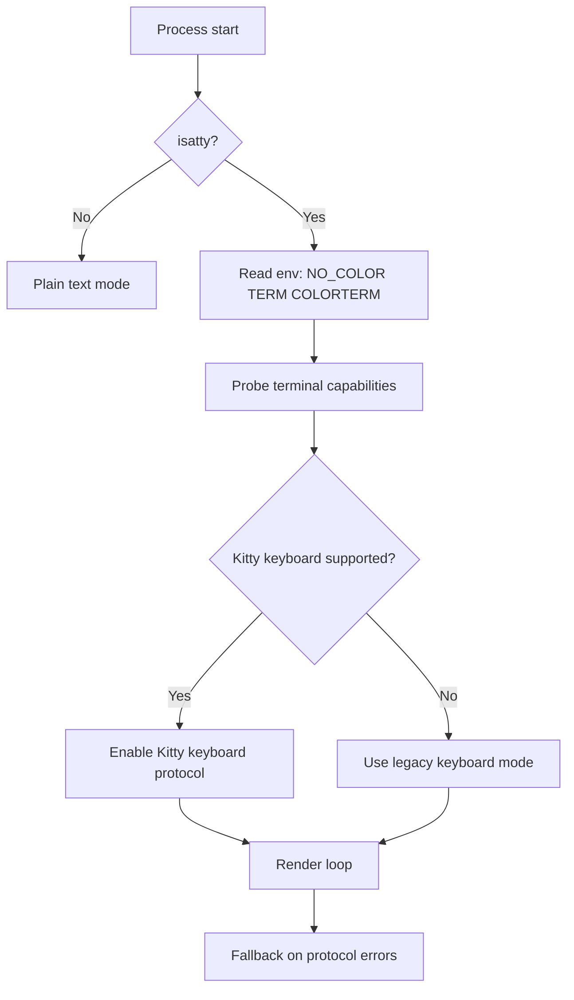

# Terminal Portability Gap Closure (CLI/TUI)

## Goal
Define a pragmatic portability strategy for Linux/macOS/Windows terminals, including tmux and SSH, while preserving performance.

## Compatibility strategy

### Tiered support

- **Tier 1 (CI-gated):**
  - Linux + modern terminal emulator
  - macOS + iTerm2/Terminal
  - Windows + Windows Terminal (ConPTY)
  - tmux on Linux/macOS
- **Tier 2 (manual smoke):**
  - SSH remote sessions
  - WSL
  - alternate emulators
- **Tier 3 (best effort):**
  - legacy or non-standard terminals

## Portability decisions for v0

1. **Keyboard:** default to legacy key reporting; enable Kitty keyboard protocol when negotiated.
2. **Mouse:** require SGR 1006 path; degrade gracefully when unavailable.
3. **Color:** obey `NO_COLOR`; auto-detect truecolor conservatively; avoid hard assumptions.
4. **Unicode width:** prefer grapheme-aware width handling; avoid emoji-heavy UI chrome in critical alignment zones.
5. **PTY model:** pipe-first for normal commands, PTY only when interactive subprocess behavior is required.

## Known problem areas

- **ConPTY:** known sequence and behavior quirks can affect precise terminal emulation behavior.
- **tmux:** truecolor and feature passthrough often require explicit terminfo flags/config.
- **SSH:** capability variables may differ from local shell environment; runtime probes should be robust.

## Capability negotiation flow

## v0 test matrix (minimum)

- Linux + xterm-compatible terminal
- Linux + tmux (`tmux-256color`)
- macOS Terminal.app
- macOS iTerm2
- Windows Terminal (PowerShell)
- Windows Terminal (WSL)
- SSH to Linux host (from macOS/Linux)
- CI non-interactive mode (no TTY)

## What to explicitly defer

- Full accessibility/screen reader integration (document gap)
- Exotic terminal protocol support beyond core compatibility targets
- Pixel/graphics protocols in v0

## References

- https://github.com/microsoft/terminal/issues/17314
- https://github.com/microsoft/terminal/issues/12166
- https://github.com/tmux/tmux/wiki/FAQ
- https://sw.kovidgoyal.net/kitty/keyboard-protocol/
- https://no-color.org/
- https://mitchellh.com/writing/grapheme-clusters-in-terminals
- https://github.com/xtermjs/xterm.js/issues/3304
- https://nodejs.org/api/tty.html
- https://man7.org/linux/man-pages/man7/pty.7.html
- https://learn.microsoft.com/windows/console/creating-a-pseudoconsole-session

## Connections
- [[../idea-honing.md]]
- [[06-runtime-semantics-gap.md]]
- [[07-startup-memory-techniques.md]]
- [[08-toolchain-portability-gap.md]]
- [[small-improvement-rho-dashboard]]
- [[openclaw-runtime-visibility-inspiration]]
