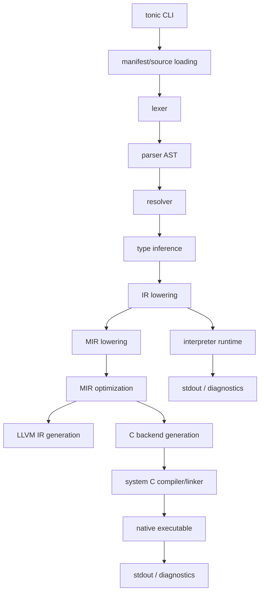
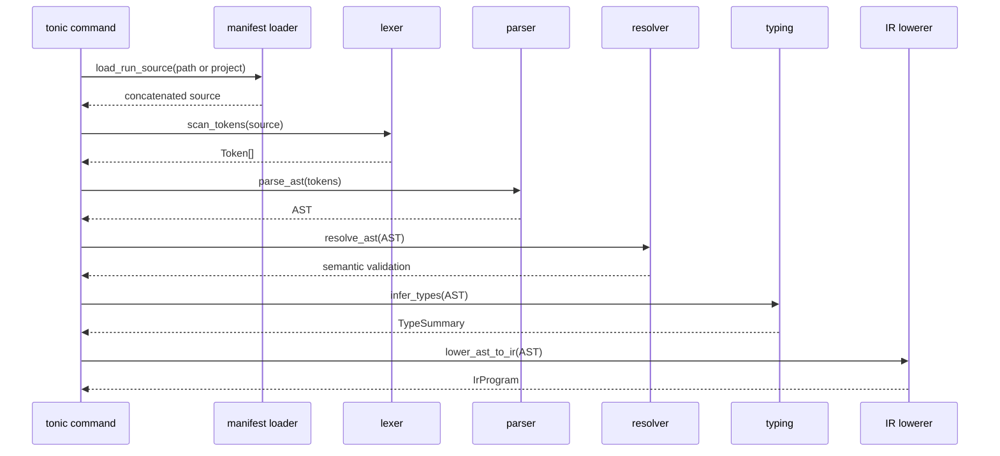
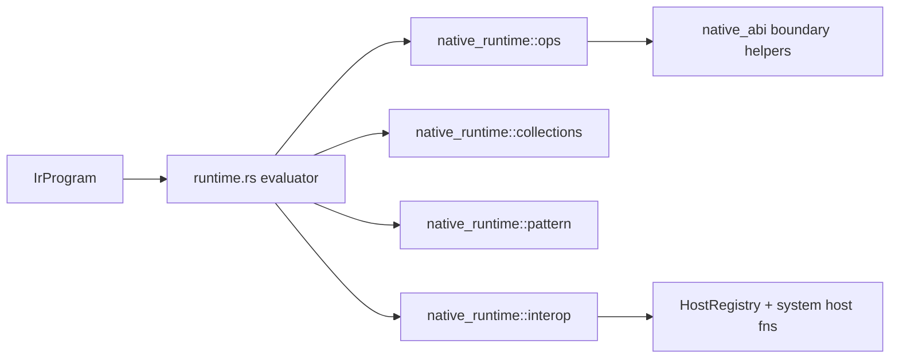

# Architecture

## 1) High-level architecture

`tonic` is a **single Rust crate** implementing:

1. A Tonic language frontend (lex/parse/resolve/type/lower).
2. Two execution paths:
   - **Interpreter path** (`tonic run` evaluates IR directly).
   - **Native path** (`tonic compile` lowers IR→MIR→C/LLVM artifacts, links executable).
3. Quality gates and parity tooling (benchmarks, differential checks, LLVM catalog parity).

## 2) Command architecture

- `run`: source/manifest load → frontend pipeline → IR eval (`runtime.rs`).
- `check`: same frontend pipeline, optional dump modes (`tokens/ast/ir/mir`).
- `test`: test file discovery + compile suite + execute discovered `test_*` functions.
- `fmt`: deterministic source reformatter over `.tn` files.
- `compile`: frontend + MIR + backend sidecars + native executable.
- `verify`: acceptance metadata + benchmark/manual evidence policy gate.
- `deps`: lockfile + dependency sync (path/git).

## 3) Frontend architecture (language)

### Notable frontend decisions

- Parser supports Elixir-like constructs (module forms, comprehensions, try/rescue/catch/after, protocol/defimpl syntax).
- Resolver emits stable diagnostic families (`E1xxx`) and checks imports/protocols/visibility.
- Type checker emits stable `E2xxx/E3xxx` diagnostics and validates `?` operator + case exhaustiveness.

## 4) Runtime architecture

There are two runtime layers:

1. **Interpreter runtime (`runtime.rs`)**
   - Stack-based IR op evaluation.
   - Runtime value model (`RuntimeValue`) includes ints, strings, lists/maps, tuples, results, closures.

2. **Native runtime helpers (`native_runtime/*`, `native_abi/*`)**
   - Shared operation helpers (`ops`, `collections`, `pattern`, `interop`).
   - C ABI-safe boundary (`TCallContext`/`TCallResult`, `TValue`, ABI version checks).

## 5) Backend architecture

### C backend

- `c_backend::lower_mir_to_c` builds a self-contained C source file.
- Includes runtime stubs/helpers and function dispatchers for multi-clause functions.
- `linker.rs` finds `clang/gcc/cc` and produces executable.

### LLVM backend

- `llvm_backend::lower_mir_subset_to_llvm_ir` emits LLVM IR text (subset-focused).
- Handles dispatcher generation, helper declarations, and main entrypoint.
- Parity validated through `llvm_catalog_parity` tooling.

## 6) Artifact architecture

`tonic compile` outputs to `.tonic/build/<stem>` by default:

- `<stem>.ll` (LLVM sidecar)
- `<stem>.c` (C source sidecar)
- `<stem>.tir.json` (IR sidecar)
- `<stem>.tnx.json` (native artifact manifest)
- `<stem>` (native executable)

## 7) Operational architecture

Quality/release is script-driven:

- `scripts/native-gates.sh` orchestrates fmt/clippy/tests/differential/parity/benchmark policy/memory guardrails.
- `scripts/release-alpha-readiness.sh` validates clean repo, changelog, and gate artifacts before alpha tag.

For operational flows, see `./workflows.md`.
