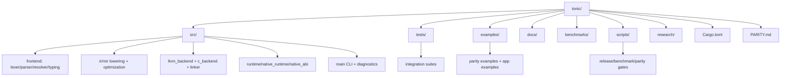
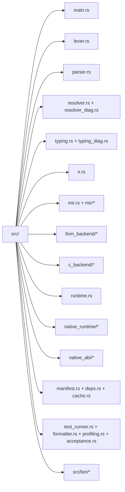

# Codebase Info: `tonic`

Generated: 2026-02-26T04:30:42Z
Codebase path: `/home/mobrienv/projects/tonic`
Analysis mode: full scan (`update_mode=false`)

## 1) Snapshot

- Primary implementation language: **Rust**
- Primary target language/runtime: **Tonic (`.tn`)** (Elixir-like syntax)
- Main crate: `tonic` (`Cargo.toml`)
- Main binary: `src/main.rs`
- Additional binaries:
  - `src/bin/benchsuite.rs`
  - `src/bin/llvm_catalog_parity.rs`
- Test surface:
  - `src/*` unit tests
  - `tests/*.rs` integration tests (120 files)

## 2) Repository scale

- Total tracked files (excluding `.git`, `target`, `.tmp`, `.worktrees`, `.tonic`): **396**
- Extensions (top):
  - `.rs`: 183
  - `.tn`: 83
  - `.md`: 50
  - `.sh`: 10
  - `.toml`: 8

### Rust LOC estimates

- `src/`: ~32,463 LOC
- `tests/`: ~12,766 LOC

### Largest implementation files (refactor candidates)

- `src/parser.rs` (5288)
- `src/c_backend/stubs.rs` (3366)
- `src/ir.rs` (1958)
- `src/llvm_backend/codegen.rs` (1612)
- `src/runtime.rs` (1428)

## 3) Top-level structure

## 4) `src/` layout map

## 5) Supported and unsupported languages

### Supported in this repository

- **Rust**: full implementation and tests.
- **Tonic (`.tn`)**: language fixtures/examples and project manifests (`tonic.toml`) consumed by compiler/runtime.
- **Bash**: operational scripts for gates, benchmarks, release checks.
- **TOML/YAML/JSON/Markdown**: manifests, acceptance metadata, reports, docs.

### Explicitly limited / unsupported (first-class compiler target)

- Not a TypeScript/Python/Go implementation codebase.
- No BEAM/OTP runtime support (called out in `PARITY.md`).
- Several Elixir parity features remain intentionally incomplete (see `PARITY.md` unchecked items).

## 6) Technology stack

- Rust 2021 edition
- Key crates: `serde`, `serde_json`, `serde_yaml`, `toml`, `reqwest` (blocking+rustls), `rand`, `hmac`, `sha2`, `base64`
- System tools used by workflows: `cargo`, `git`, `clang/gcc/cc`, `python3`, `sh`, `/usr/bin/time`

## 7) Primary integration points

- CLI surface (`tonic`) for `run/check/test/fmt/compile/verify/deps`
- Host interop registry (`host_call`) including system primitives (`System.*` wrappers)
- Native runtime ABI boundary (`TValue`, `TCallContext`, `TCallResult`)
- Benchmark and parity binaries (`benchsuite`, `llvm_catalog_parity`)
- File-system cache + artifacts under `.tonic/`

## 8) Key references

- Architecture: `./architecture.md`
- Components: `./components.md`
- Interfaces: `./interfaces.md`
- Data models: `./data_models.md`
- Workflows: `./workflows.md`
- Dependencies: `./dependencies.md`
- Parity scope and status: `PARITY.md`
