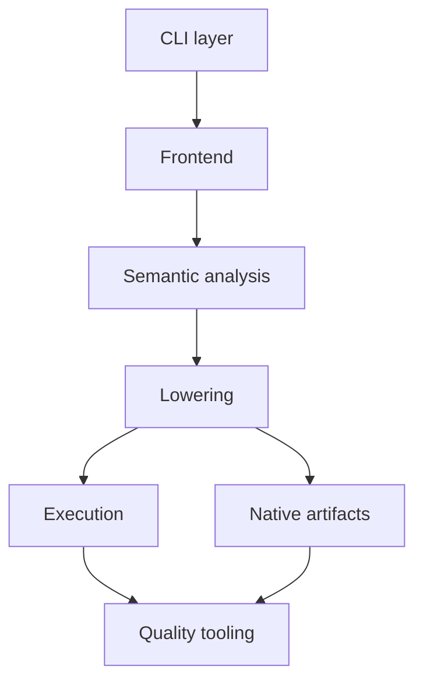
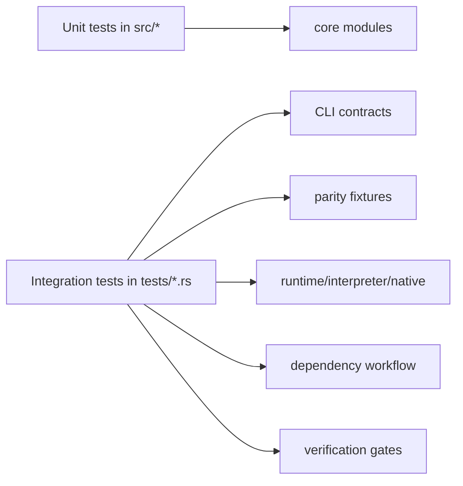

# Components

## Component relationship map

## Core components

| Component | Paths | Responsibility | Key outputs |
|---|---|---|---|
| CLI dispatcher | `src/main.rs` | Parses top-level commands and routes to handlers | Exit codes + diagnostics |
| CLI diagnostics | `src/cli_diag.rs` | Deterministic error formatting (usage/failure/snippets) | Stable user-facing error contract |
| Source + manifest loader | `src/manifest.rs` | Handles single-file/project loading, module aggregation, optional stdlib injection, dependency source loading | Unified source string |
| Dependency resolver | `src/deps.rs` | `tonic.lock` generation/load/save, path/git dependency sync | Lockfile + `.tonic/deps` cache |
| Compile cache | `src/cache.rs` | IR cache keys and atomic cache artifact writes under `.tonic/cache` | Cache hit/miss behavior |
| Lexer | `src/lexer.rs` | Tokenizes Tonic source into typed tokens with spans | `Vec<Token>` |
| Parser | `src/parser.rs` | Builds AST for modules/forms/expressions/patterns; canonicalizes call targets (`alias/import/use`) | `Ast` |
| Resolver | `src/resolver.rs`, `src/resolver_diag.rs` | Symbol/module/protocol/import/guard validation with stable `E1xxx` diagnostics | Semantic validity |
| Type inference | `src/typing.rs`, `src/typing_diag.rs` | Constraint-based type inference + diagnostics (`E2xxx/E3xxx`) | `TypeSummary` |
| IR lowerer | `src/ir.rs` | AST→IR lowering including protocol dispatch synthesis and default arg wrappers | `IrProgram` |
| MIR lowerer/optimizer | `src/mir.rs`, `src/mir/*` | IR→CFG-like MIR and native-oriented simplifications | `MirProgram` |
| Interpreter runtime | `src/runtime.rs` | Evaluates IR stack machine semantics and function dispatch/closures/errors | `RuntimeValue` |
| Native runtime helpers | `src/native_runtime/*` | Shared operation semantics for interpreter/native backends | Op/collection/pattern/interop helpers |
| Native ABI | `src/native_abi/*` | ABI-safe value transport (`TValue`) and runtime boundary invocation | `TCallResult` / ABI enforcement |
| C backend | `src/c_backend/*` | MIR→C source lowering + dispatcher/runtime stubs | `.c` source |
| LLVM backend | `src/llvm_backend/*` | MIR subset→LLVM IR lowering | `.ll` source |
| Native linker | `src/linker.rs` | Invokes `clang/gcc/cc` to build executable from C source | Native executable |
| Native artifact manifest | `src/native_artifact.rs` | Sidecar schema, validation, and IR reload for backward-compatible run | `.tnx.json` contract |
| Test runner | `src/test_runner.rs` | Discovers `test_` functions in `.tn` files and executes them | Text/JSON test reports |
| Formatter | `src/formatter.rs` | Rewrites/checks `.tn` formatting | `FormatReport` |
| Profiler | `src/profiling.rs` | Per-phase timings emitted to stderr/JSONL via env flags | Timing traces |
| Acceptance verifier | `src/acceptance.rs` | Loads acceptance YAML + feature/manual evidence metadata | Verification inputs |

## Tooling binaries

| Binary | Path | Responsibility |
|---|---|---|
| `benchsuite` | `src/bin/benchsuite.rs` + `src/bin/benchsuite/*` | Benchmark execution, contract scoring, JSON/Markdown reports |
| `llvm_catalog_parity` | `src/bin/llvm_catalog_parity.rs` | Catalog-driven compile/runtime parity checks for active fixtures |

## Scripted operational components

| Script | Purpose |
|---|---|
| `scripts/native-gates.sh` | Full native gate pipeline (fmt/clippy/test/differential/parity/bench/policy/memory) |
| `scripts/release-alpha-readiness.sh` | Release preflight + blocking checks |
| `scripts/native-regression-policy.sh` | Strict/advisory policy verdict (`pass/quarantine/rollback`) |
| `scripts/bench-native-contract-enforce.sh` | Bench contract runner wrapper |
| `scripts/memory-bakeoff.sh` | Memory mode bakeoff and CI guardrails |

## Test architecture components

Integration suite highlights (counts):

- `run_*`: 39
- `check_dump_*`: 22
- `runtime_*`: 12
- `compile_*`: 10
- `verify_*`: 7
