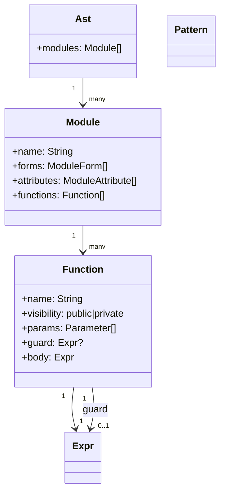
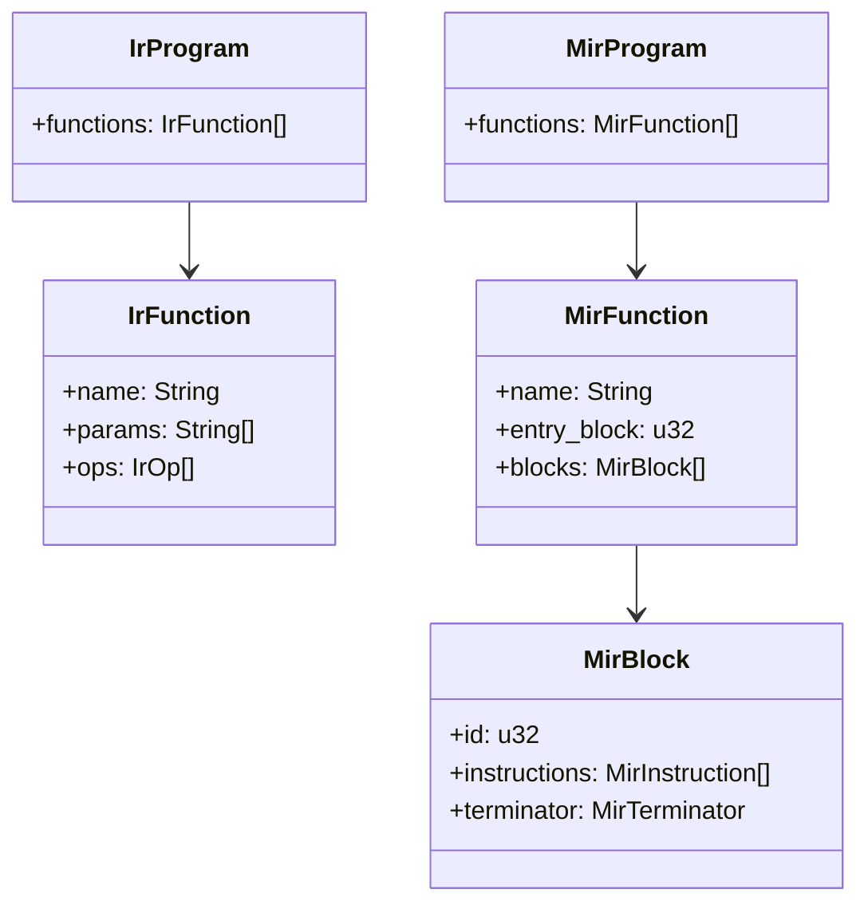
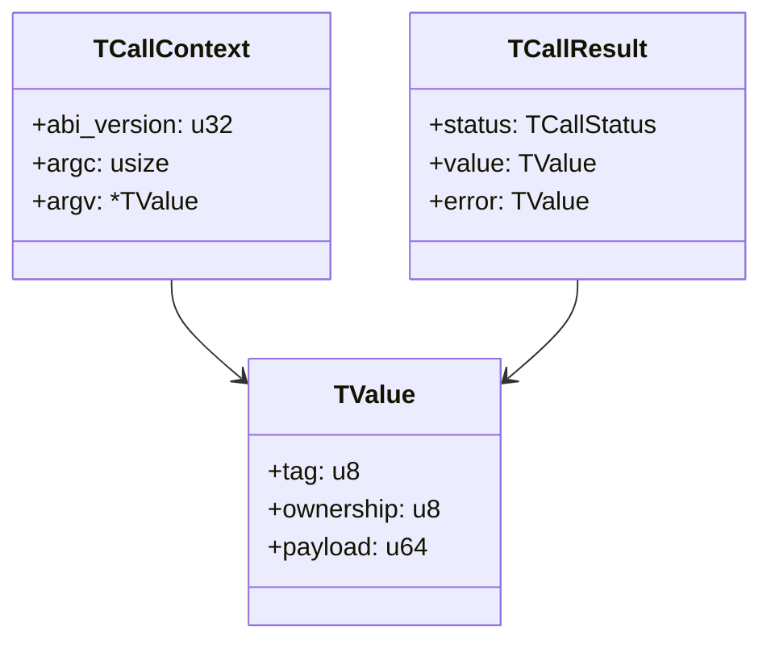

# Data Models

## 1) Language frontend models

### AST model (`src/parser.rs`)

- Root: `Ast { modules: Vec<Module> }`
- `Module`: name + module forms + attributes + functions
- `Function`: name, visibility, params, optional guard, body expression
- `Expr`: tagged union covering literals, calls, pattern/control flow forms, comprehensions, try/raise, closures
- `Pattern`: tagged union for match/case/function-head patterns

## 2) Intermediate representation models

### IR model (`src/ir.rs`)

- `IrProgram { functions: Vec<IrFunction> }`
- `IrFunction`: qualified name, params, optional param patterns/guard ops, op list
- `IrOp`: stack-machine operations (const/call/control-flow/collection/pattern ops)
- `IrPattern`: runtime-matchable patterns

### MIR model (`src/mir.rs`)

- CFG-style lowering with typed virtual values
- `MirProgram -> MirFunction -> MirBlock`
- `MirInstruction` + `MirTerminator` (`Return/Jump/Match/ShortCircuit`)

## 3) Runtime value model

### Interpreter value domain (`src/runtime.rs`)

`RuntimeValue` variants:

- Scalars: `Int`, `Float`, `Bool`, `Nil`, `String`, `Atom`
- Algebraic/container: `ResultOk`, `ResultErr`, `Tuple`, `List`, `Map`, `Keyword`, `Range`
- Functional: `Closure`

`RuntimeError` includes message + optional source offset + optional raised payload.

## 4) Native ABI model

### `TValue` and boundary structs (`src/native_abi/mod.rs`)

- `TValue` (16-byte ABI cell): `tag`, `ownership`, `payload`
- Immediate payload tags: int/bool/nil
- Heap payload tags: string/list/map/keyword/tuple/result/closure/range/...
- `TCallContext`: call frame (`abi_version`, `argc`, `argv`)
- `TCallResult`: status + value/error payloads

## 5) Project/dependency models

### Manifest/dependency model (`src/manifest.rs`, `src/deps.rs`)

- `ProjectManifest`: entry path + dependencies
- `Dependencies`: path deps + git deps
- `Lockfile`: canonicalized `path_deps` and pinned `git_deps`

### Native artifact model (`src/native_artifact.rs`)

- `NativeArtifactManifest`: schema/version/backend/target/hash/cache key metadata
- `NativeArtifactFiles`: paths to `ir`, `llvm_ir`, and object/executable artifacts

## 6) Benchmark/parity report models

### Benchmark model (`src/bin/benchsuite/model.rs`)

- `SuiteManifest` with workloads and optional `performance_contract`
- `SuiteReport` with `workloads`, host metadata, and optional contract summary
- Contract scoring model with SLO verdicts and weighted competitive scores

### Parity report model (`src/bin/llvm_catalog_parity.rs`)

- `ParityReport`: fixture outcomes + compile/runtime mismatch summaries + top failure causes

## 7) Acceptance verification model

From `src/acceptance.rs`:

- `AcceptanceMetadata`: path, feature files, optional benchmark metrics, manual evidence requirements
- `FeatureScenario`: scenario id + tags parsed from feature files
- Used by `tonic verify run` to produce JSON gate results.
