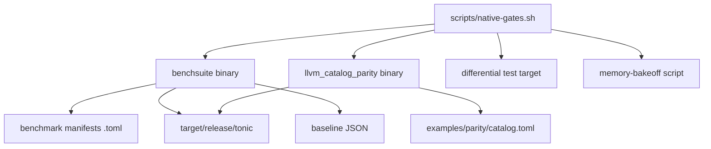

# Dependencies

## 1) Rust crate dependencies (`Cargo.toml`)

| Dependency | Purpose in codebase | Key touchpoints |
|---|---|---|
| `serde` (+derive) | Serialization foundations | AST/IR/MIR/report structs |
| `serde_json` | JSON encoding/decoding | dump modes, cache/artifacts, benchmark/parity reports |
| `serde_yaml` | Acceptance metadata parsing | `src/acceptance.rs` |
| `toml` | Manifest/lockfile/benchmark catalog parsing | `manifest.rs`, `deps.rs`, `benchsuite`, parity catalog |
| `reqwest` (blocking, rustls) | HTTP host interop primitive | `src/interop/system.rs` (`sys_http_request`) |
| `rand` | Secure random token generation | `sys_random_token` |
| `hmac` + `sha2` | HMAC-SHA256 host primitive | `sys_hmac_sha256_hex` |
| `base64` | URL-safe token encoding | `sys_random_token` |

### Dev dependencies

| Dependency | Purpose |
|---|---|
| `assert_cmd` | CLI command integration tests |
| `predicates` | Assertion helpers in test suites |

## 2) System/toolchain dependencies

| Tool | Required for | Notes |
|---|---|---|
| `cargo` / `rustc` | build, test, fmt, clippy | core Rust workflow |
| `clang` / `gcc` / `cc` | native executable linking from generated C | required by `tonic compile` |
| `git` | fetching git deps in `tonic deps sync` | clones pinned revisions |
| `sh` | system host function `sys_run` | executes shell commands via `sh -lc` |
| `python3` | policy + bakeoff scripts | used in `native-regression-policy.sh` and `memory-bakeoff.sh` |
| `time` (`/usr/bin/time`) | memory bakeoff RSS measurement | configurable by env var |

## 3) Project-managed dependency data

- `tonic.toml` `[dependencies]`
  - Path dependency: `{ path = "..." }`
  - Git dependency: `{ git = "...", rev = "..." }`
- `tonic.lock`
  - Versioned lock data with canonicalized path deps and pinned git deps
- Cached git checkouts: `.tonic/deps/<dep_name>/`

## 4) Runtime helper dependencies

Host/system primitives depend on:

- Filesystem (`sys_path_exists`, `sys_ensure_dir`, `sys_write_text`, `sys_read_text`)
- Process execution (`sys_run`)
- Network (`sys_http_request` over reqwest)
- Environment and process metadata (`sys_env`, `sys_which`, `sys_cwd`, `sys_argv`)
- Crypto/random (`sys_random_token`, `sys_hmac_sha256_hex`)

## 5) Benchmark/parity dependency graph

## 6) Optional/operational environment controls

Notable env families:

- Profiling: `TONIC_PROFILE_*`
- Benchmarks/policy: `TONIC_BENCH_*`, `TONIC_NATIVE_*`, `TONIC_PARITY_*`
- Memory behavior: `TONIC_MEMORY_*`
- Debug tracing: `TONIC_DEBUG_*`
- Release override knobs: `TONIC_ALPHA_*`

## 7) Risk notes

- Native compile path depends on local C toolchain availability and behavior.
- `deps sync` depends on external git network access unless cache is already warm.
- Host HTTP primitive is intentionally bounded (timeouts, max body bytes, redirect caps), but still introduces network variability.
