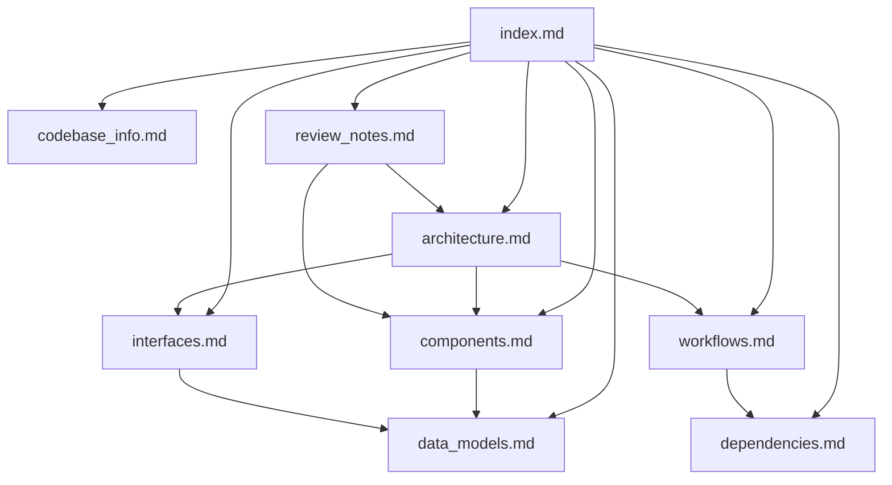

# Tonic Knowledge Base Index (for AI Assistants)

> Primary context file for this documentation set.
>
> Load this file first, then selectively load referenced files based on question intent.

Generated: 2026-02-26T04:30:42Z
Location: `.agents/summary/`

## How to use this index

1. **Start here** to identify relevant docs.
2. Use the **Question routing guide** below.
3. Pull only the minimum additional files needed for the user’s request.
4. Prefer repo-source truth when docs and code diverge.

## Documentation map

## Table of contents with metadata

| File | Tags | Best for | Summary |
|---|---|---|---|
| `index.md` | `meta`, `routing`, `ai-context` | Deciding what to read next | Primary AI navigation layer across generated docs. |
| `codebase_info.md` | `inventory`, `topology`, `language-support` | Repo shape, scale, supported/unsupported languages | Snapshot stats, directory map, language and technology overview. |
| `architecture.md` | `architecture`, `pipeline`, `runtime`, `backend` | End-to-end system design | Frontend→IR→MIR→runtime/backend architecture and artifact model. |
| `components.md` | `components`, `ownership`, `module-map` | Which module does what | Component catalog with paths, responsibilities, and outputs. |
| `interfaces.md` | `api`, `cli`, `abi`, `interop` | CLI/API contracts and integration points | Command interfaces, host interop, ABI boundary, env controls. |
| `data_models.md` | `schemas`, `types`, `ast`, `ir`, `mir` | Core structs/enums and report schemas | Canonical model definitions and relationships. |
| `workflows.md` | `operations`, `dev-loop`, `release`, `gates` | How work gets executed | Run/compile/test/deps/verify/parity/benchmark/release workflows. |
| `dependencies.md` | `dependencies`, `toolchain`, `external` | Crates/tools and operational requirements | Rust/system dependency inventory and risk notes. |
| `review_notes.md` | `quality`, `consistency`, `gaps` | Known documentation gaps/inconsistencies | Consistency check results and improvement recommendations. |

## Question routing guide

### If asked about...

- **“How does tonic execute code?”**
  - Read: `architecture.md`, then `interfaces.md`
- **“Which file/module should I edit?”**
  - Read: `components.md`, then `codebase_info.md`
- **“What are the command flags/contracts?”**
  - Read: `interfaces.md`
- **“What data types are passed around?”**
  - Read: `data_models.md`
- **“How do release gates / benchmarks work?”**
  - Read: `workflows.md`, `dependencies.md`
- **“What’s missing or risky?”**
  - Read: `review_notes.md`

## Retrieval strategy for assistants

- **Fast triage mode (small context budget):**
  1. `index.md`
  2. `components.md` *or* `interfaces.md` (question-dependent)

- **Implementation planning mode:**
  1. `index.md`
  2. `architecture.md`
  3. `components.md`
  4. `workflows.md`

- **Debugging mode:**
  1. `index.md`
  2. `interfaces.md`
  3. `workflows.md`
  4. targeted source files

## Example assistant queries

- “Show me the compile pipeline and where to add a new optimization pass.”
- “Which component owns dependency lockfile generation?”
- “What’s the ABI contract for native helper functions?”
- “How does `tonic verify run` decide pass/fail?”
- “Which scripts are blocking for alpha release?”

## Source-of-truth policy

- Generated docs summarize current codebase state at generation time.
- For implementation-critical decisions, verify against source files in `src/` and scripts in `scripts/`.
- See `review_notes.md` for known gaps and areas requiring manual confirmation.
