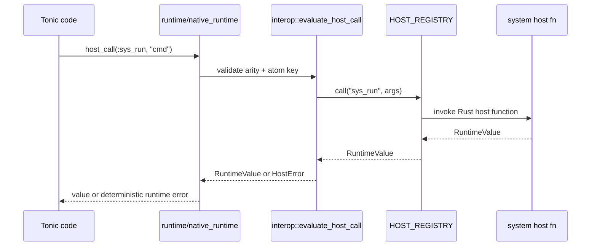
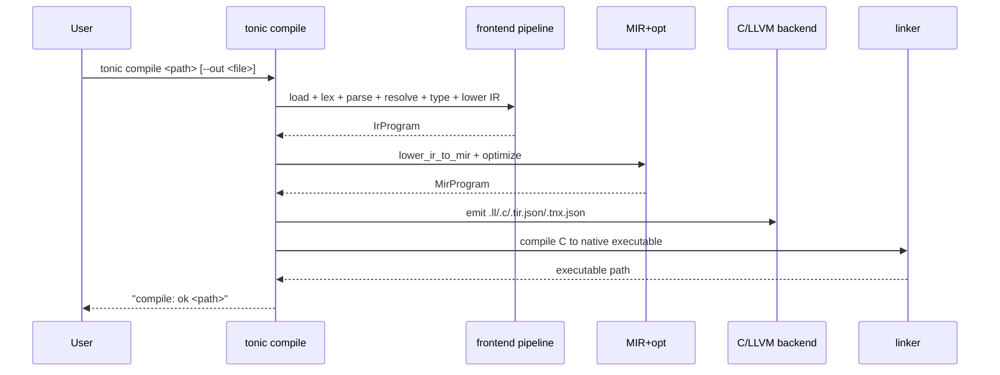

# Interfaces

## 1) User-facing CLI interfaces

## `tonic` CLI (primary)

Command surface from `src/main.rs`:

- `tonic run <path>`
- `tonic check <path> [--dump-tokens|--dump-ast|--dump-ir|--dump-mir]`
- `tonic test <path> [--format <text|json>]`
- `tonic fmt <path> [--check]`
- `tonic compile <path> [--out <artifact-path>]`
- `tonic cache` (placeholder)
- `tonic verify run <slice-id> [--mode <auto|mixed|manual>]`
- `tonic deps <sync|fetch|lock>`

### Diagnostics contract

- Usage errors: exit code `64`
- Failures: exit code `1`
- Success: exit code `0`
- Source-aware failures include line/column/snippet context where offset is known.

## `benchsuite` CLI

From `src/bin/benchsuite.rs` + model parser:

- Inputs: `--bin`, `--manifest`, `--runs`, `--warmup`, `--json-out`, `--markdown-out`, `--enforce`, optional contract knobs.
- Outputs: JSON + optional Markdown report including host metadata and optional performance contract verdict.

## `llvm_catalog_parity` CLI

From `src/bin/llvm_catalog_parity.rs`:

- `--catalog`, `--report-json`, `--report-md`, `--tonic-bin`, `--enforce`
- Runs compile/runtime parity checks for active catalog fixtures.

## 2) Internal module interfaces

### Frontend APIs

- `scan_tokens(source) -> Result<Vec<Token>, LexerError>`
- `parse_ast(tokens) -> Result<Ast, ParserError>`
- `resolve_ast(ast) -> Result<(), ResolverError>`
- `infer_types(ast) -> Result<TypeSummary, TypingError>`
- `lower_ast_to_ir(ast) -> Result<IrProgram, LoweringError>`

### Mid-end / backend APIs

- `lower_ir_to_mir(ir) -> Result<MirProgram, MirLoweringError>`
- `optimize_for_native_backend(mir) -> MirProgram`
- `llvm_backend::lower_mir_subset_to_llvm_ir(mir) -> Result<String, LlvmBackendError>`
- `c_backend::lower_mir_to_c(mir) -> Result<String, CBackendError>`
- `linker::compile_c_to_executable(c_path, exe_path)`

### Runtime APIs

- `evaluate_entrypoint(&IrProgram) -> Result<RuntimeValue, RuntimeError>`
- `evaluate_named_function(&IrProgram, fn_name)`
- Native helper entrypoints (ABI boundary):
  - `tonic_rt_add_int`
  - `tonic_rt_cmp_int_eq`
  - `tonic_rt_map_put`
  - `tonic_rt_host_call`
  - `tonic_rt_protocol_dispatch`

## 3) Host interop interface (`host_call`)

`host_call(:atom_key, ...)` resolves through `HOST_REGISTRY`.

Registered system keys include:

- `:sys_run`
- `:sys_path_exists`
- `:sys_ensure_dir`
- `:sys_write_text`
- `:sys_read_text`
- `:sys_read_stdin`
- `:sys_http_request`
- `:sys_env`
- `:sys_which`
- `:sys_cwd`
- `:sys_argv`
- `:sys_random_token`
- `:sys_hmac_sha256_hex`

## 4) Native ABI interface

Core boundary types (`src/native_abi/mod.rs`):

- `TONIC_RUNTIME_ABI_VERSION = 1`
- `TValue` (`tag`, `ownership`, `payload`)
- `TCallContext` (`abi_version`, `argc`, `argv`)
- `TCallResult` (`status`, `value`, `error`)
- Status: `Ok | Err | Panic | InvalidAbi`

Boundary handler:

- `invoke_runtime_boundary(ctx, helper)`
  - Validates ABI version + call frame.
  - Decodes `TValue` arguments.
  - Catches panics.
  - Returns deterministic error payloads.

## 5) Data/report interfaces

- `tonic.lock`: dependency lockfile (`version`, `path_deps`, `git_deps`).
- Native artifact manifest (`*.tnx.json`): schema/version/backend/target/cache key + sidecar paths.
- Benchmark report (`SuiteReport`): workloads, metadata, optional performance contract summary.
- Parity report (`ParityReport`): fixture outcomes + mismatch aggregation.

## 6) Environment variable interfaces

High-impact env controls:

- Runtime/compile behavior: `TONIC_DEBUG_CACHE`, `TONIC_DEBUG_MODULE_LOADS`, `TONIC_DEBUG_TYPES`
- Profiling: `TONIC_PROFILE_STDERR`, `TONIC_PROFILE_OUT`
- Memory modes/stats: `TONIC_MEMORY_MODE`, `TONIC_MEMORY_STATS`
- Benchmark wrappers: `TONIC_BENCH_*`, `TONIC_NATIVE_*`, `TONIC_PARITY_*`
- Release gate knobs: `TONIC_ALPHA_*`

## 7) Command flow interface diagram

