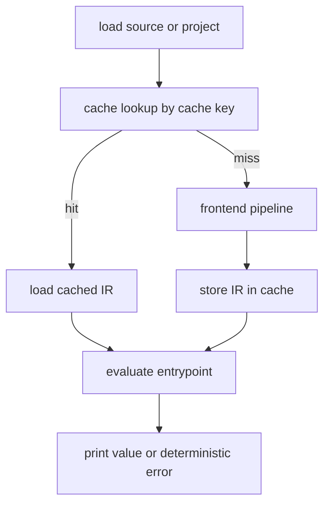
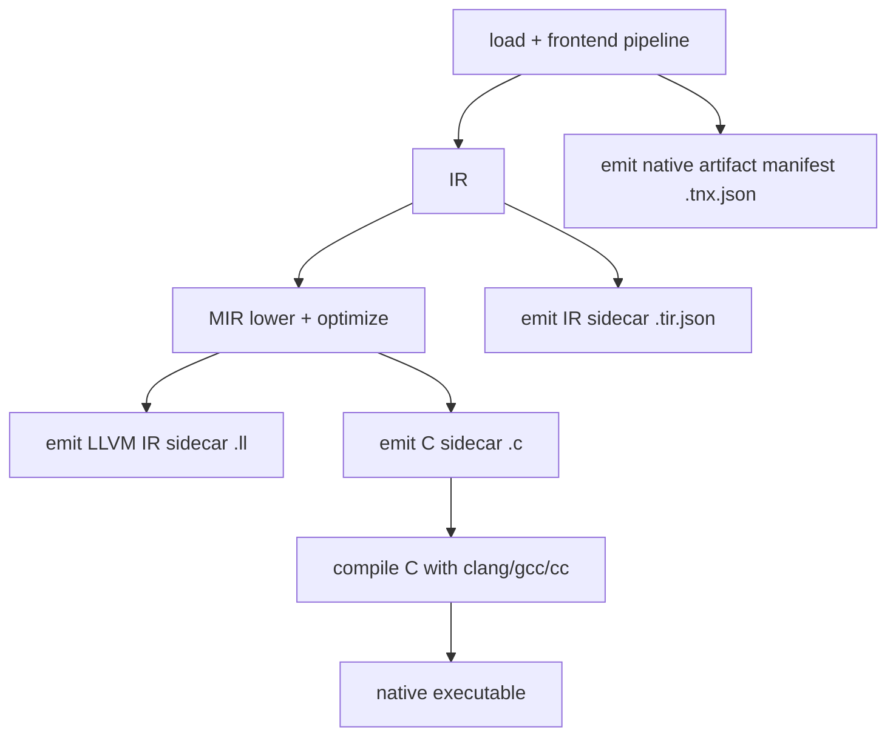
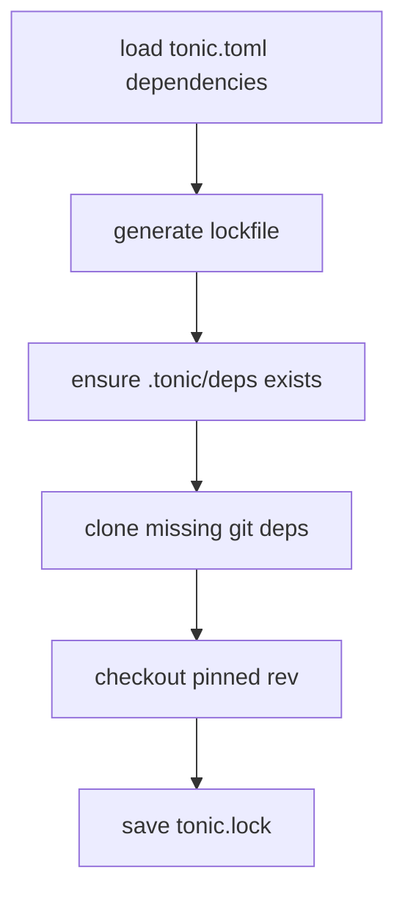
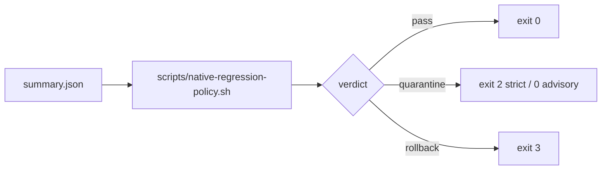

# Workflows

## 1) Developer command workflows

## `tonic run <path>`

Key notes:

- Project directories are supported (`tonic.toml` entry + sibling module aggregation).
- Dependency sources are pulled from lockfile/cached deps.
- Optional stdlib modules (`Enum`, `System`) are lazily injected based on source references.

## `tonic compile <path>`

Outputs are written under `.tonic/build/` unless `--out` is provided.

## `tonic check <path>`

- Runs frontend pipeline up to requested stage.
- Supports exactly one dump mode at a time.
- Emits `check: ok` when checking a directory path without dump mode.

## `tonic test <path>`

- Discovers `.tn` test files (`test_*.tn` / `*_test.tn`).
- Compiles each suite and executes public arity-0 `test_*` functions.
- Supports text or JSON report output.

## 2) Dependency workflows (`tonic deps`)

### `tonic deps lock`

- Reads `[dependencies]` from `tonic.toml`.
- Canonicalizes path deps and records git url/rev.
- Writes `tonic.lock`.

### `tonic deps sync` / `fetch`

## 3) Verification workflow (`tonic verify run`)

- Loads `acceptance/<slice-id>.yaml`.
- Loads feature files and filters scenarios by mode tags:
  - `auto`: `@auto`
  - `mixed`: `@auto`, `@agent-manual`
  - `manual`: `@auto`, `@agent-manual`, `@human-manual`
- Evaluates benchmark thresholds and manual evidence presence/JSON validity.
- Emits JSON verdict (`pass/fail`) with detailed gate sections.

## 4) Parity and differential workflows

## Differential backend correctness

- Command: `cargo test --test differential_backends -- --nocapture`
- Compares interpreter vs native execution on curated and generated fixtures.
- Writes triage artifacts on mismatch (`program.tn`, minimized repro, mismatch JSON).

## LLVM catalog parity gate

- Script: `./scripts/llvm-catalog-parity-enforce.sh`
- Uses `examples/parity/catalog.toml` active entries.
- Fails on compile/runtime mismatches and writes JSON/Markdown reports.

## 5) Benchmark and policy workflows

## Native contract benchmark flow

- Script wrapper: `scripts/bench-native-contract-enforce.sh`
- Runs `target/release/benchsuite` with contract manifest.
- Emits `native-compiler-summary.{json,md}` or compiled-target equivalent.

## Regression policy flow

## 6) Release readiness workflow

- Script: `scripts/release-alpha-readiness.sh --version X.Y.Z-alpha.N`
- Blocking checks:
  - clean git working tree
  - matching `CHANGELOG.md` heading
  - successful `scripts/native-gates.sh`
  - required benchmark artifacts present and non-empty

## 7) Memory bakeoff workflow

- Script: `scripts/memory-bakeoff.sh [--ci]`
- Compiles selected memory fixtures, executes each under modes (`default`, `append_only`, `rc`, `trace`), records elapsed/RSS/reclaim metrics.
- CI mode enforces guardrails (e.g., default resolves to trace, trace reclaims cycles better than append-only).
