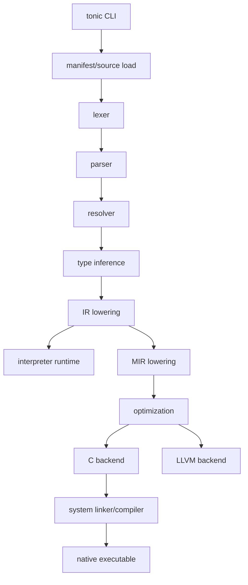

# Tonic

Tonic is an **alpha-stage language core** with Elixir-inspired syntax and a Rust implementation.
It supports both:

- an interpreter execution path (`tonic run`), and
- a native compile path (`tonic compile`) that emits sidecars and a runnable executable.

## Why Elixir-like syntax is a strong fit for LLM-assisted coding

Tonic leans into Elixir-style syntax because it is usually easier for LLMs to generate and refactor correctly at the **structural** level:

- **Pattern matching + clause-based control flow** make branches explicit and reduce hidden behavior.
- **Immutable data flow** reduces mutation/aliasing complexity in long completions.
- The **pipe operator (`|>`)** provides a predictable composition pattern that is easy to continue token-by-token.

But syntax is not magic: multilingual benchmark work still shows a gap between *fluent syntax* and *semantic correctness*, especially for low-resource ecosystems and concurrency-heavy behavior.

References:
- MultiPL-E benchmark: <https://huggingface.co/datasets/nuprl/MultiPL-E>
- Multilingual code-gen benchmarking (MultiPL-E paper): <https://arxiv.org/abs/2305.12138>
- Functional-program reasoning benchmark (FPEval): <https://arxiv.org/abs/2601.02060>
- Elixir patterns/guards docs: <https://hexdocs.pm/elixir/patterns-and-guards.html>
- Elixir control-flow docs (`case`/`cond`/`if`): <https://hexdocs.pm/elixir/1.16/case-cond-and-if.html>

**TL;DR:** Elixir-style syntax improves generation ergonomics; robust semantics still come from tight tests, diagnostics, and runtime gates.

## Table of contents

| Section | Summary |
|---|---|
| [1. Project overview](#1-project-overview) | What Tonic is and what the repo contains today. |
| [2. Status and scope](#2-status-and-scope) | Current maturity and explicit scope boundaries. |
| [3. Prerequisites](#3-prerequisites) | Required tools to build and run the project. |
| [4. Quickstart](#4-quickstart) | Fast path to build, run, test, and compile examples. |
| [5. CLI commands](#5-cli-commands) | Command-level reference for day-to-day usage. |
| [6. Architecture snapshot](#6-architecture-snapshot) | Frontend → IR/MIR → runtime/backend flow. |
| [7. Repository layout](#7-repository-layout) | Where core code, tests, examples, and scripts live. |
| [8. Quality gates and benchmarks](#8-quality-gates-and-benchmarks) | Differential/parity/benchmark workflows and scripts. |
| [9. Runtime diagnostics and profiling](#9-runtime-diagnostics-and-profiling) | High-signal env flags for debugging and performance analysis. |
| [10. Release workflow](#10-release-workflow) | Alpha readiness and release gate process. |
| [11. Documentation map](#11-documentation-map) | Links to deeper docs and generated AI-oriented summaries. |
| [12. Contributing notes](#12-contributing-notes) | Practical expectations for changes and validation. |

<!-- tags: overview,purpose,language-core -->
## 1. Project overview

Tonic is a Rust codebase implementing:

- **Frontend**: lexer, parser, resolver, and type inference for `.tn` programs.
- **IR/MIR lowering**: internal representations used by runtime and native backends.
- **Runtime**: interpreter semantics, pattern matching, control flow, and host interop.
- **Native path**: C/LLVM lowering plus executable linking.
- **Tooling**: test runner, formatter, benchmark harness, parity gates, and release checks.

See also:
- [Architecture snapshot](#6-architecture-snapshot)
- [Repository layout](#7-repository-layout)

<!-- tags: status,alpha,scope -->
## 2. Status and scope

- Current crate version: `0.1.0-alpha.1`.
- Project is actively evolving and optimized for rapid parity/prototyping work.
- Language parity work is tracked in `PARITY.md`.
- BEAM/OTP runtime behavior is **out of scope** for this project (see `PARITY.md` scope note).

See also:
- `PARITY.md`
- `docs/native-runtime.md`

<!-- tags: setup,toolchain,requirements -->
## 3. Prerequisites

- Rust toolchain (cargo + rustc)
- A C compiler in `PATH` (`clang`, `gcc`, or `cc`) for native compile/link path
- `git` (for dependency sync workflows)
- `python3` (used by some operational scripts)

Optional but useful:
- GNU `time` for memory bakeoff scripts

<!-- tags: quickstart,build,run,compile,test -->
## 4. Quickstart

### Build

```bash
cargo build
```

### Run a language example

```bash
cargo run -- run examples/parity/02-operators/arithmetic_basic.tn
```

### Static check (with optional dumps)

```bash
cargo run -- check examples/parity/06-control-flow/for_multi_generator.tn
cargo run -- check examples/parity/06-control-flow/for_multi_generator.tn --dump-ast
```

### Run Rust test suites

```bash
cargo test
```

### Format `.tn` sources

```bash
cargo run -- fmt examples --check
```

### Compile to native executable and run it

```bash
cargo run -- compile examples/parity/02-operators/arithmetic_basic.tn --out ./.tonic/build/arithmetic_basic
./.tonic/build/arithmetic_basic
```

See also:
- [CLI commands](#5-cli-commands)
- [Quality gates and benchmarks](#8-quality-gates-and-benchmarks)

<!-- tags: cli,reference,developer-workflow -->
## 5. CLI commands

Primary command surface (`tonic`):

- `tonic run <path>`
- `tonic check <path> [--dump-tokens|--dump-ast|--dump-ir|--dump-mir]`
- `tonic test <path> [--format <text|json>]`
- `tonic fmt <path> [--check]`
- `tonic compile <path> [--out <artifact-path>]`
- `tonic verify run <slice-id> [--mode <auto|mixed|manual>]`
- `tonic deps <sync|fetch|lock>`

Quick examples:

```bash
cargo run -- deps lock
cargo run -- deps sync
cargo run -- test examples/parity --format json
```

See also:
- `src/main.rs`
- `docs/differential-testing.md`

<!-- tags: architecture,pipeline,frontend,backend -->
## 6. Architecture snapshot



Compile artifacts default to `.tonic/build/<stem>` and include:

- executable (`<stem>`)
- LLVM IR (`<stem>.ll`)
- C source (`<stem>.c`)
- Tonic IR (`<stem>.tir.json`)
- native artifact manifest (`<stem>.tnx.json`)

See also:
- `docs/native-runtime.md`
- `docs/runtime-abi.md`
- `docs/memory-management-roadmap.md`

<!-- tags: layout,codebase,navigation -->
## 7. Repository layout

- `src/` — core implementation
  - frontend: `lexer.rs`, `parser.rs`, `resolver.rs`, `typing.rs`
  - lowering: `ir.rs`, `mir/*`
  - runtimes: `runtime.rs`, `native_runtime/*`, `native_abi/*`
  - backends: `c_backend/*`, `llvm_backend/*`, `linker.rs`
- `tests/` — integration and contract tests
- `examples/` — language examples and parity fixtures
- `benchmarks/` — benchmark manifests and baseline data
- `scripts/` — gate/enforce/release scripts
- `docs/` — focused technical docs
- `PARITY.md` — parity checklist and status

<!-- tags: quality,gates,benchmark,parity -->
## 8. Quality gates and benchmarks

High-signal workflows:

- Differential correctness gate:
  ```bash
  ./scripts/differential-enforce.sh
  ```
- LLVM catalog parity gate:
  ```bash
  ./scripts/llvm-catalog-parity-enforce.sh
  ```
- Full native gate stack:
  ```bash
  ./scripts/native-gates.sh
  ```

Benchmark references:

- `benchmarks/README.md`
- `benchmarks/native-compiler-suite.toml`
- `benchmarks/native-compiled-suite.toml`
- `scripts/native-regression-policy.sh`

See also:
- `docs/native-regression-policy.md`
- `docs/differential-testing.md`

<!-- tags: debugging,profiling,memory -->
## 9. Runtime diagnostics and profiling

Useful environment toggles:

- `TONIC_DEBUG_CACHE=1` — cache hit/miss tracing
- `TONIC_DEBUG_MODULE_LOADS=1` — module load tracing
- `TONIC_DEBUG_TYPES=1` — type summary trace
- `TONIC_PROFILE_STDERR=1` — per-phase timing to stderr
- `TONIC_PROFILE_OUT=<path>` — JSONL timing output
- `TONIC_MEMORY_MODE=<append_only|rc|trace>` + `TONIC_MEMORY_STATS=1` — runtime memory diagnostics

For memory strategy/bakeoff details:
- `docs/memory-management-roadmap.md`
- `docs/runtime-memory-bakeoff.md`

<!-- tags: release,alpha,checklist -->
## 10. Release workflow

Alpha readiness is gated by:

```bash
./scripts/release-alpha-readiness.sh --version X.Y.Z-alpha.N
```

This checks:

- clean git working tree
- changelog/version heading
- full native gates
- required benchmark artifacts

See also:
- `docs/release-checklist.md`

<!-- tags: docs,reference,ai-context -->
## 11. Documentation map

Core docs:

- `PARITY.md`
- `docs/native-runtime.md`
- `docs/runtime-abi.md`
- `docs/differential-testing.md`
- `docs/native-regression-policy.md`
- `docs/release-checklist.md`

Generated codebase summaries (AI-oriented):

- `.agents/summary/index.md` (primary index)
- `.agents/summary/architecture.md`
- `.agents/summary/components.md`
- `.agents/summary/interfaces.md`
- `.agents/summary/workflows.md`

<!-- tags: contributing,validation,expectations -->
## 12. Contributing notes

Suggested local preflight before opening changes:

```bash
cargo fmt --all -- --check
cargo clippy --all-targets --all-features -- -D warnings
cargo test
```

For release- or parity-sensitive changes, also run:

```bash
./scripts/native-gates.sh
```

Repository-local working rules are in `AGENTS.md`.
