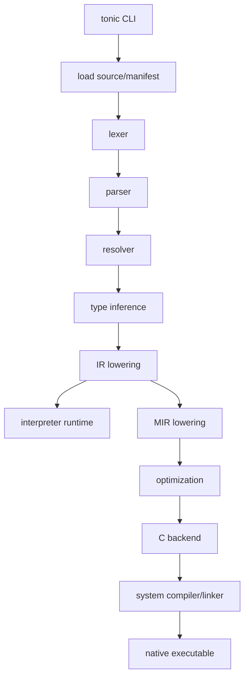

# Tonic

> **Elixir-inspired language design, implemented in Rust, with an interpreter-first workflow and a native compilation path.**
>
> Tonic is an alpha-stage language core for people who want expressive functional syntax, a practical local toolchain, and a compiler/runtime they can actually study and extend.

## Why Tonic?

Tonic is opinionated about developer experience:

- **Readable functional code shape** — modules, clauses, pattern matching, guards, tuples, maps, ranges, and functional control flow.
- **Fast inner loop** — run code directly with `tonic run`.
- **Native output path** — compile programs to executables with `tonic compile`.
- **Real project workflow** — multi-file projects, formatting, checking, tests, dependency management, verification, docs, and LSP surfaces already exist in the CLI.
- **Compiler-engineering focus** — parity tracking, differential testing, native gate scripts, and self-hosting milestones are part of the repo itself.

If you like Elixir-style syntax and want to explore a Rust-based language/runtime that is honest about its current maturity, Tonic is built for that.

## Project status
- **Version:** `0.1.0-alpha.3`
- **Stability:** alpha — behavior and interfaces are still evolving
- **Scope:** language syntax/runtime parity work plus native backend iteration
- **Primary backend:** portable C backend for production/native builds
- **Current stdlib baseline:** workload-backed `String` + `System`, with `Path` available but secondary
- **Self-hosting status:** partial — current milestone is parity-verified self-hosted lexer work, not full bootstrap closure
- **Out of scope:** BEAM/OTP runtime semantics such as supervisors, distribution, and hot upgrades

For parity details, see [PARITY.md](PARITY.md).
For self-hosting progress, see [docs/self-hosting-status.md](docs/self-hosting-status.md).
For the current stdlib boundary, see [docs/core-stdlib-profile.md](docs/core-stdlib-profile.md).

## Quickstart

### Prerequisites

- Rust toolchain (`cargo`, `rustc`)
- C compiler in `PATH` (`clang`, `gcc`, or `cc`) for native compile/link
- `git`
- `python3` for some scripts

### Build the CLI

```bash
git clone https://github.com/mikeyobrien/tonic.git
cd tonic
cargo build --bin tonic
```

### Run the demo program

```bash
cargo run --bin tonic -- run examples/parity/02-operators/arithmetic_basic.tn
```

Expected output:

```text
{3, {2, {8, 5}}}
```

### Compile the same program to a native executable

```bash
cargo run --bin tonic -- compile examples/parity/02-operators/arithmetic_basic.tn --out ./.tonic/build/arithmetic_basic
./.tonic/build/arithmetic_basic
```

Expected output:

```text
{3, {2, {8, 5}}}
```

### Explore the CLI surface

```bash
cargo run --bin tonic -- --help
```

Current top-level commands include `run`, `repl`, `check`, `test`, `fmt`, `compile`, `cache`, `verify`, `deps`, `install`, `installed`, `docs`, and `lsp`.

## 60-second tour

### Run a single file

```bash
cargo run --bin tonic -- run examples/parity/02-operators/arithmetic_basic.tn
```

### Run a project-mode example

```bash
cargo run --bin tonic -- run examples/apps/stdlib_showcase
```

### Type-check and inspect internals

```bash
cargo run --bin tonic -- check examples/parity/01-literals/atom_expression.tn --dump-tokens --format json
```

### Format and test

```bash
cargo run --bin tonic -- fmt examples --check
cargo run --bin tonic -- test examples/parity --format json
```

## Minimal language example

```tn
defmodule Demo do
  def run() do
    with {:ok, v1} <- {:ok, 10},
         {:ok, v2} <- {:ok, 20} do
      v1 + v2
    end
  end
end
```

Run it:

```bash
cargo run --bin tonic -- run path/to/file.tn
```

## What you get today

- Frontend pipeline: lexer → parser → resolver → type inference
- IR + MIR lowering
- Interpreter runtime via `tonic run`
- Native compile flow with C sidecars via `tonic compile`
- Multi-file project entry via `tonic.toml`
- `.tn` test runner with text/JSON output
- Formatting and static checking
- Dependency sync/fetch/lock workflows
- Global module install workflow via `tonic install` / `tonic installed`
- API docs generation and LSP command surfaces

## CLI cheat sheet

| Command | Purpose | Example |
|---|---|---|
| `tonic run <path>` | Execute a file or project (`tonic.toml`) | `cargo run --bin tonic -- run examples/apps/stdlib_showcase` |
| `tonic check <path> [--dump-tokens [--format <text\|json>]\|--dump-ast\|--dump-ir\|--dump-mir]` | Parse/type-check and optionally dump internals | `cargo run --bin tonic -- check examples/parity/01-literals/atom_expression.tn --dump-tokens --format json` |
| `tonic test <path> [--format <text\|json>]` | Run discovered `.tn` tests | `cargo run --bin tonic -- test examples/parity --format json` |
| `tonic fmt <path> [--check]` | Format source files or verify formatting | `cargo run --bin tonic -- fmt examples --check` |
| `tonic compile <path> [--out <artifact-path>] [--target <triple>]` | Produce native executable + sidecars | `cargo run --bin tonic -- compile examples/parity/02-operators/arithmetic_basic.tn --out ./.tonic/build/arithmetic_basic` |
| `tonic deps <sync\|fetch\|lock>` | Sync/fetch/lock dependencies for a `tonic.toml` project | `cargo run --bin tonic -- deps lock` |
| `tonic install <source>` | Install a tonic module globally | `cargo run --bin tonic -- install .` |
| `tonic installed` | List installed tonic modules | `cargo run --bin tonic -- installed` |
| `tonic verify run <slice-id> [--mode <auto\|mixed\|manual>]` | Run acceptance verification flow | `cargo run --bin tonic -- verify run step-01 --mode auto` |
| `tonic docs <path>` | Generate API documentation | `cargo run --bin tonic -- docs examples/apps/stdlib_showcase` |

`tonic cache` currently exists as a placeholder command surface.

## Native compile artifacts

By default, compile outputs are written to `.tonic/build/<stem>`:

- Executable: `<stem>`
- C source sidecar: `<stem>.c`
- Tonic IR sidecar: `<stem>.tir.json`
- Native artifact manifest: `<stem>.tnx.json`

Tonic also supports cross-compilation on `tonic compile` for these targets:

- `x86_64-unknown-linux-gnu`
- `aarch64-unknown-linux-gnu`
- `x86_64-apple-darwin`
- `aarch64-apple-darwin`

See [docs/cross-compilation.md](docs/cross-compilation.md) for toolchain details and examples.

## Architecture at a glance


```mermaid
graph TD
    CLI[tonic CLI]
    CLI --> LOAD[load source/manifest]
    LOAD --> LEX[lexer]
    LEX --> PARSE[parser]
    PARSE --> RESOLVE[resolver]
    RESOLVE --> TYPE[type inference]
    TYPE --> IR[IR lowering]

    IR --> INTERP[interpreter runtime]
    IR --> MIR[MIR lowering]
    MIR --> OPT[optimization]
    OPT --> CBACK[C backend]
    CBACK --> LINK[system compiler/linker]
    LINK --> EXE[native executable]
```

## Examples worth opening first

- [examples/README.md](examples/README.md) — curated overview of project-mode examples
- [examples/apps/stdlib_showcase](examples/apps/stdlib_showcase) — compact stdlib/project-mode demo
- [examples/apps/self_hosted_lexer](examples/apps/self_hosted_lexer) — self-hosted lexer milestone example
- [examples/apps/tonicctl](examples/apps/tonicctl) — CLI-style app structure in Tonic

## Engineering quality gates

Tonic ships with high-signal validation workflows:

```bash
./scripts/differential-enforce.sh
./scripts/native-gates.sh
```

Release-readiness gate:

```bash
./scripts/release-alpha-readiness.sh --version X.Y.Z-alpha.N
```

Benchmark docs and manifests:

- [benchmarks/README.md](benchmarks/README.md)
- [benchmarks/native-compiler-suite.toml](benchmarks/native-compiler-suite.toml)
- [benchmarks/native-compiled-suite.toml](benchmarks/native-compiled-suite.toml)

## Diagnostics and profiling hooks

- `TONIC_DEBUG_CACHE=1` — cache hit/miss traces
- `TONIC_DEBUG_MODULE_LOADS=1` — module-load traces
- `TONIC_DEBUG_TYPES=1` — type-signature summaries
- `TONIC_PROFILE_STDERR=1` — per-phase timings on stderr
- `TONIC_PROFILE_OUT=<path>` — JSONL timing output
- `TONIC_MEMORY_MODE=<append_only|rc|trace>` + `TONIC_MEMORY_STATS=1` — memory diagnostics
- `TONIC_OBS_ENABLE=1` — local observability bundles under `.tonic/observability/`

See [docs/observability.md](docs/observability.md) for bundle layout and investigation workflow.

## Repository layout

- `src/` — compiler, runtime, CLI, and backend implementation
- `tests/` — integration and contract tests
- `examples/` — parity fixtures and app examples
- `benchmarks/` — benchmark manifests and baselines
- `scripts/` — gate, benchmark, and release scripts
- `docs/` — focused technical docs
- `PARITY.md` — syntax parity checklist and priorities

## Documentation map

- [PARITY.md](PARITY.md) — syntax parity tracking and priorities
- [docs/core-stdlib-profile.md](docs/core-stdlib-profile.md) — current stdlib boundary and parity policy
- [docs/system-stdlib.md](docs/system-stdlib.md) — `System` host-backed API surface
- [docs/native-runtime.md](docs/native-runtime.md)
- [docs/runtime-abi.md](docs/runtime-abi.md)
- [docs/differential-testing.md](docs/differential-testing.md)
- [docs/observability.md](docs/observability.md)
- [docs/cross-compilation.md](docs/cross-compilation.md)
- [docs/native-regression-policy.md](docs/native-regression-policy.md)
- [docs/release-checklist.md](docs/release-checklist.md)
- [docs/self-hosting-status.md](docs/self-hosting-status.md)
- [CHANGELOG.md](CHANGELOG.md)

## Contributing

Contributions are welcome.

Suggested preflight before opening a PR:

```bash
cargo fmt --all -- --check
cargo clippy --all-targets --all-features -- -D warnings
cargo test
```

For parity-sensitive or runtime-sensitive changes, also run:

```bash
./scripts/native-gates.sh
```

Repository-specific working notes are in [AGENTS.md](AGENTS.md).

## Roadmap (near term)

See [PARITY.md](PARITY.md) for full tracking. Current near-term gaps include:

- Numeric literal parity (hex/octal/binary, separators, char literals)
- Operator parity (`===`, `!==`, `div`, `rem`, `not in`, stepped ranges, bitwise family)
- Bitstring and binary pattern parity
- Additional compile-time and module-form parity
- Continued stdlib/profile expansion

## License

This project is licensed under the [MIT License](LICENSE).
